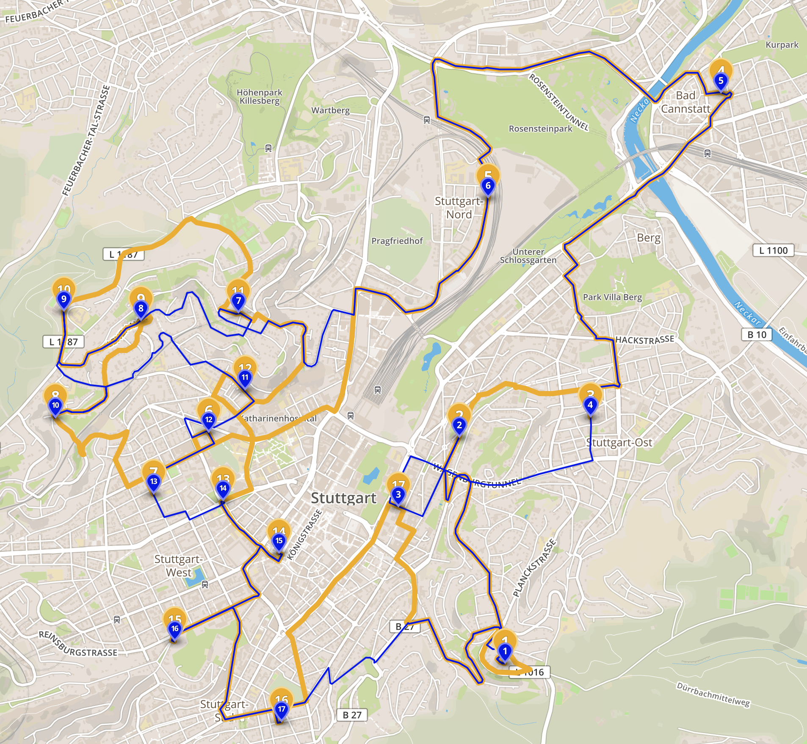

# Elevation Sensitive Routing for Electric Vehicles

For comparability, this repository starts two routing engines. One which has implemented the standard car routing profile from [OSRM](https://github.com/Project-OSRM/osrm-backend) and the other additionally implements the punishment defined in the coding competition from [IT-Talents](https://www.it-talents.de/foerderung/code-competition/code-competition-04-2018).

## Prerequisites

The whole software was developed and tested on macOS Sierra (10.12.6), but should also work on most Unix systems. It is necessary that you have installed Docker, Makefile and Python 3. For downloading the data also an internet connection is required. The necessary memory depends on the area for which the data shall be loaded (recommended disk space > 20 GB). The code was tested with the following docker computing resources:
* CPUs: 4
* Memory: 8 GB

## Getting Started

It is necessary to extract elevation data as well as data about the road network. OSRM supports map extracts from [OSM](https://www.openstreetmap.org). 

### Starting the Routing Engines

The whole data extraction and start up process is automated by a [makefile](https://en.wikipedia.org/wiki/Makefile). This makefile defines the area for which the data is extracted, the osm file which is downloaded and available for the routing engines. 

As make offers the option to override environment variables in the makefile you can pass the following values to choose your location. Per default the elevation data for Germany will be extracted and the OSM map of Baden-Wuerttemberg. For example you can specify to load the Berlin map with `make start -e OSM_FILE=berlin-latest`. For the full description of possible options see the top section of the makefile. For starting the routing engines with default settings execute the following command:

`make start`

Hint: The whole process took up to 4 hours for the default parameters due to the download and elevation extraction process.

Two routing engines will per default be available on `localhost:5000` and `localhost:6000`. The first has the standard car profile activated and the second the electric cars profile. The full API can be checked in the [official documentation](http://project-osrm.org/docs/v5.5.1/api/). 

### Command Line Comparison Tool

For simplicity we will also provide a command line tool for comparing the results of both routing engines. It will execute both routings and subsequently open a browser window for comparing the two routes. For installing the required packages please execute:

`pip install -r requirements.txt`

From this point you can call the command line tool help with:

`python compare.py --help` or `python compare.py -h`

A possible execution of the command line tool could look like:

`python compare.py --simplified True 13.409595 52.520241 13.453975 52.549387 13.381804 52.552794`

All further necessary information is given by the help of the command line tool.

# The Routing Profile

The routing profile includes way more information than just the distance. The basis of this routing profile was given by [OSRM/Profiles](https://github.com/Project-OSRM/osrm-backend/blob/master/docs/profiles.md) and considers many factors such as road type, road surface, turing conditions, traffic light and many more which will result in a weight for each node of the graph behind. The electric profile additionally queries a Postgres/Postgis database for extracting height information and calculating the slope. If the slope exceeds the defines threshold in the task description a factor is applied on the weight. Therefore this project implements a more realistic routing than in the task description. 

The specific implementation of the electric car profile can be found in the file `profiles/electric.lua` in the lines 493 to 550. However, the estimated consumption is calculated by the command line tool and will be displayed on the standard out like:
<pre>
------------ Comparison of routing profiles ------------
Power Consumption Car profile:                  15.49 kw
Power Consumption Electric Car profile:         15.49 kw
--------------------------------------------------------
</pre>

For a good comparison of the 'regular route' with the optimized routes for electric vehicles the comparison tool will open the resulting routes in [geosjon.io](geosjon.io) such as:

The orange line reflects the car profile and the blue line the route for electric vehicles. The numbers on the markers reflect the waypoints and their order.

# Repository Structure

Subsequently the output of `tree .` is shown for a rough overview of the repository.

<pre>
.
├── README.md
├── compare.py
├── data (automatically created)
│   └── raster
├── makefile
├── osrm (automatically created)
│   ├── car
│   └── electric
├── profiles
│   ├── car.lua
│   └── electric.lua
├── requirements.txt
└── scripts
    ├── extract-srtm.sh
    ├── fetch-srtm.sh
    ├── startup-postgis.sh
    └── startup-routing.sh
</pre>

The following table summarizes the purpose of each file/folder

| File/folder               | Purpose                                                                                    |
|:-------------------------:|:------------------------------------------------------------------------------------------:|
| README.md                 | Readme for starting and explanation                                                        |
| compare.py                | Command line tool for comparing the regular routing with the routing for electric vehicles |
| data/raster               | Working directory for raster data                                                          |
| makefile                  | For a simple startup of the routing engines                                                |
| osrm/car                  | Working directory for the car routing engine                                               |
| osrm/electric             | Working directory for the electric car routing engine                                      |
| profiles/car.lua          | Lua script defining the car profile                                                        |
| profiles/electric.lua     | Lua script defining the electric car profile                                               |
| requirements.txt          | For installing the required python libraries                                               |
| scripts/*                 | Helper scripts for starting the engines and loading the data                               |
